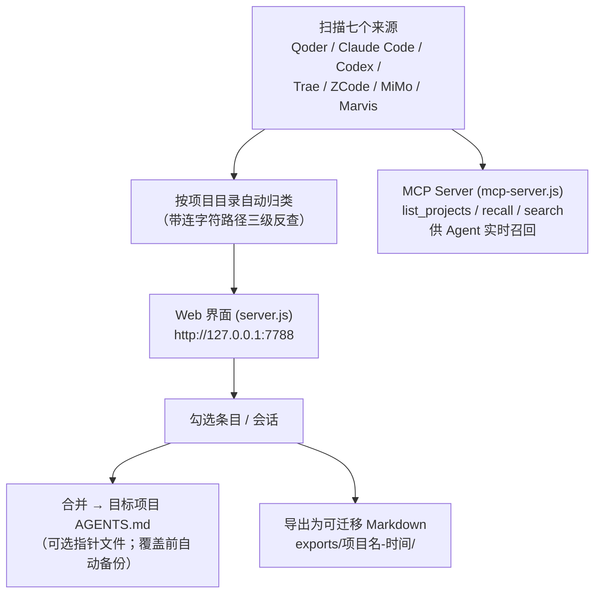
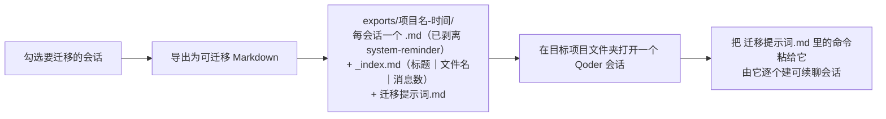

<div align="center">

# 记忆中枢 (Memory Hub)

**一个极简本地 Web 工具，统一管理本机所有 AI Agent 的记忆与会话。**

Scan every local AI tool's memory & sessions, merge them into one `AGENTS.md`, query live via MCP, or export whole conversations to migrate into another agent.


</div>

同一个项目用不同的 AI 工具轮流开发时，把各家积累的记忆合并成一份 `AGENTS.md`，任何工具开始工作前先读它，不用每次重新说明需求；也可以让 Agent 通过 MCP 实时查询，或把整段历史对话导出、迁进别的工具接着聊。

版本历史见 [CHANGELOG.md](CHANGELOG.md)。

---

## 目录

- [功能](#功能)
- [整体流程](#整体流程)
- [支持的扫描来源](#支持的扫描来源)
- [运行](#运行)
- [使用流程](#使用流程)
- [导出与迁移](#导出与迁移把历史对话搬进别的-agent)
- [MCP 接入](#mcp-接入agent-实时查询记忆)
- [Claude Code 自动刷新](#claude-code-自动刷新)
- [项目结构](#项目结构)
- [说明与注意](#说明与注意)
- [常见问题 FAQ](#常见问题-faq)
- [协议](#协议)

---

## 功能

- 全盘扫描本机各 AI 工具的记忆与会话记录，按项目目录自动归类（七个来源：Qoder、Claude Code、Codex、Trae、ZCode、MiMo、Marvis）
- 勾选任意条目，合并写入目标项目的 `AGENTS.md`（合并前自动备份原文件）
- 可选生成指针文件（`CLAUDE.md` / `QODER.md` / `.trae/rules/project_rules.md`），内容指向同目录的 `AGENTS.md`
- 会话记录自动提取【最初需求】和【最终产出】两条精华，而不是只存截断的标题
- 内置 MCP Server，Agent 工作时可实时召回记忆（`list_projects` / `recall` / `search`）
- 勾选会话可导出为可迁移 Markdown（完整对话 + 索引 + 迁移提示词），用于把历史对话迁进别的 Agent 接着聊

## 整体流程



## 支持的扫描来源

| 来源 | 用户级记忆 | 项目级记忆 | 会话记录 |
|---|---|---|---|
| Qoder | 不展示（文件保留在 `~/.qoder-cn/memory/`，由 Qoder 自行管理） | `~/.qoder-cn/projects/<项目>/memory/*.md` | 不支持 |
| Claude Code | `~/.claude/CLAUDE.md` | 项目 `CLAUDE.md`、`.claude/memory/`、`~/.claude/projects/<项目>/memory/` | 会话 jsonl 提取需求与产出 |
| Codex | `~/.codex/memories_1.sqlite` | 会话按 cwd 自动归项目 | `~/.codex/sessions` rollout 提取 |
| Trae | 用户规则（state.vscdb） | 项目 `.trae/rules/*.md` | 不支持 |
| ZCode | 不支持 | 会话按目录归项目 | 会话正文从 message/part 表提取 |
| MiMo | `~/.local/share/mimocode/memory/projects/global/MEMORY.md` | mimocode.db 按 `project.worktree` 归项目 | mimocode.db 会话从 message/part 表提取 |
| Marvis | `~/.marvis/database/memory.db` | 不支持 | 不支持 |

带连字符的项目路径（如 `Agent-5`）无法从 slug 直接还原，采用三级反查：已知真实路径锚点、常见目录枚举匹配、Claude 会话文件提取 cwd。

## 运行

```bash
node server.js
```

启动后访问 <http://127.0.0.1:7788>。也可以双击 `启动记忆中枢.cmd`。

依赖：**Node.js 22+**（使用了内置的 `node:sqlite`）。

## 使用流程

1. 启动服务，左侧选择一个项目（或一组用户级记忆）
2. 勾选要合并的条目，可先在搜索框过滤
3. 选择合并目标项目，点击合并
4. 项目根目录生成 `AGENTS.md`，各 AI 工具开始工作前先完整阅读该文件

## 导出与迁移（把历史对话搬进别的 Agent）

`AGENTS.md` 只带得走「精华摘要」。要把整段历史对话搬进另一个 Agent 接着聊，用导出：



1. 勾选要迁移的会话，点「导出为可迁移 Markdown」
2. 产物落在 `exports/<项目名>-<时间>/`：每个会话一个 `.md`（完整对话，已剥离 system-reminder 等噪音）、`_index.md`（标题 | 文件名 | 消息数）、`迁移提示词.md`
3. 在**目标项目文件夹**里打开一个 Qoder 会话，把 `迁移提示词.md` 里那行命令粘给它，由它逐个建可续聊的会话

导出支持 MiMo / ZCode（session-message-part 三表）与 Claude Code / Codex（会话 jsonl）的完整正文；纯记忆文件按原文导出，消息数记为 0。

> 迁移侧的建会话逻辑不在本仓库：`create_chat_session` 是 Qoder 的内置工具，只有 Qoder 里的 Agent 能调，所以这一步靠提示词文件交接。提示词里已写明先建样板核验、再批量（建出的会话无法用工具删除），没装配套技能时也能照着执行。配套技能见 [migrate-conversations-to-qoder](https://github.com/YTZ-create/migrate-conversations-to-qoder)。

## MCP 接入（Agent 实时查询记忆）

任何支持 MCP 的 Agent（Qoder、Claude Code、ZCode 等）都可接入 memory-hub，在工作时实时拉取记忆而非只在开头读一次 `AGENTS.md`。提供三个工具：

- `list_projects`：列出所有扫描到的项目及各来源条数
- `recall`：按项目名召回该项目全部记忆（含会话中的最初需求与最终产出）
- `search`：跨来源关键词搜索

在 Agent 的 MCP 配置中加入：

```json
{
  "mcpServers": {
    "memory-hub": {
      "command": "node",
      "args": ["<memory-hub 所在目录>\\mcp-server.js"]
    }
  }
}
```

注意：MCP Server 是独立进程，自己完成扫描，不需要先启动 `server.js`；网页界面和合并功能则需要 `server.js` 保持运行。

## Claude Code 自动刷新

已支持通过 SessionEnd Hook 在 Claude Code 会话结束时自动触发重新扫描（`~/.claude/settings.json` 的 `hooks.SessionEnd` 调用 `notify-rescan.js`），新会话立即出现在界面，无需手动刷新。

## 项目结构

```
server.js        HTTP 服务与 API（scan / file / merge / export）
lib/scan.js      各来源扫描与 slug 反查
lib/merge.js     AGENTS.md 生成与指针文件写入
lib/export.js    会话导出为可迁移 Markdown
mcp-server.js    MCP Server（供 Agent 实时查询记忆）
notify-rescan.js Claude Code SessionEnd Hook 入口
public/          前端单页界面
exports/         导出产物（已 gitignore）
```

## 说明与注意

- 所有数据均保存在本机，扫描使用**只读**方式打开各工具的数据库
- 扫描结果缓存 30 秒，手动删除 `AGENTS.md` 等外部变动最迟 30 秒后反映到页面，点「重新扫描」立即刷新
- 合并只会新建或覆盖 `AGENTS.md` 与指针文件，**不会改动任何工具自身的记忆数据**
- 合并覆盖前原文件自动备份为 `AGENTS.md.bak-<时间戳>`
- 导出只在 `exports/` 下新建文件，同样不改动任何来源数据；导出的对话正文会剥离 `<system-reminder>` 等系统注入内容，但**不会**自动脱敏，分享前请自行检查密钥与 token

## 常见问题 FAQ

**Q：会读取/修改我各工具原始记忆吗？**
A：扫描是**只读**；合并只新建或覆盖目标项目的 `AGENTS.md` 与指针文件，不动任何工具自身的记忆数据，覆盖前还会备份。

**Q：MCP Server 需要先开 `server.js` 吗？**
A：不需要。`mcp-server.js` 是独立进程、自己扫描；只有网页界面和合并功能才依赖 `server.js` 常驻。

**Q：为什么某个项目路径识别不出来？**
A：带连字符的路径（如 `Agent-5`）无法从 slug 直接还原，工具用「已知路径锚点 → 常见目录枚举 → Claude 会话提取 cwd」三级反查兜底。

**Q：导出的对话能直接公开分享吗？**
A：导出会剥离 `<system-reminder>`，但**不脱敏**。分享前请自行检查密钥与 token。

**Q：Qoder 的用户级记忆为什么不展示？**
A：这些文件保留在 `~/.qoder-cn/memory/` 由 Qoder 自行管理，故用户级不展示；项目级 `~/.qoder-cn/projects/<项目>/memory/*.md` 会展示，会话记录暂不支持。

## 协议

[MIT](LICENSE)
